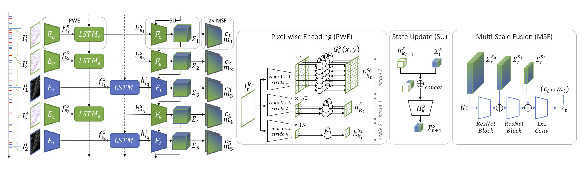

# Deep Visual Odometry with Events and Frames

<p align="center">
  <a href="https://youtu.be/mzSQR2MEAsU">
    
  </a>
</p>

This is the official Pytorch implementation of the **IROS 2024** paper [Deep Visual Odometry with Events and Frames](https://rpg.ifi.uzh.ch/docs/IROS24_Pellerito.pdf) using Recurrent Asynchronous and Massively Parallel (RAMP) networks for Visual Odometry (VO).

## Citation
If you use any part of this code or datasets accompanying the paper please consider citing the following
```bibtex
@InProceedings{Pellerito_2024_IROS,
    author    = {Pellerito, Roberto and Cannici, Marco and Gehrig, Daniel and Belhadj, Joris and 
                Dubois-Matra, Olivier and Casasco, Massimo and Scaramuzza, Davide},
    title     = {Deep Visual Odometry with Events and Frames},
    booktitle = {IEEE/RSJ International Conference on Intelligent Robots (IROS)},
    month     = {June},
    year      = {2024}
}
```

## Method Overview
We introduce RAMP-VO, the first end-to-end learned image- and event-based VO system. 
It leverages novel Recurrent, Asynchronous, and Massively Parallel (RAMP) encoders capable of fusing
asynchronous events with image data.

<p align="center">
  
</p>


## Installation
### Conda
You can directly create a new conda environment using the provided `environment.yml` file.
```Bash
conda env create -f environment.yml
conda activate rampvo
```
Depending on your CUDA version you might need to install a different version of `torch`.
The following code was tested with python 3.10.0 and CUDA 12.2 on a Nvidia GPU Quadro RTX 8000.
```Bash
pip install torch torchvision torchaudio --index-url https://download.pytorch.org/whl/cu124
pip install -r requirements.txt
```
Since we use lietorch for the Lie group operations, you need to install some additional packages.
To install required eigen-3.4.0, run the following commands:

```Bash
cd rampvo
wget https://gitlab.com/libeigen/eigen/-/archive/3.4.0/eigen-3.4.0.zip
unzip eigen-3.4.0.zip -d thirdparty
```
Finally install Ramp VO package.

```Bash
cd rampvo
pip install .
```

## Pre-trained Checkpoints
Download the pre-trained checkpoints and place them a the `checkpoints` folder.
<table><tbody>
<th valign="bottom"></th>
<th valign="bottom">RAMP-VO Multi scale</th>
<th valign="bottom">RAMP-VO Single scale</th>
<tr><td align="left">checkpoint</td>
<td align="center"><a href="https://download.ifi.uzh.ch/rpg/web/data/iros24_rampvo/checkpoints/RAMPVO_MultiScale.pth">download</a></td>
<td align="center"><a href="https://download.ifi.uzh.ch/rpg/web/data/iros24_rampvo/checkpoints/RAMPVO_SingleScale.pth">download</a></td>
</tr>
</tbody></table>

## Datasets
### TartanEvent
Tartan Event is a version of the TartanAir dataset with added event camera data. 
- Download TartanAir dataset [here](https://theairlab.org/tartanair-dataset/).
- Download the TartanEvent dataset with the provided script and uncompress it in the same folder as TartanAir:

    `UNZIP_FILES=true DELETE_FILES=true ./scripts/download_tartanevent.sh /path/to/TartanAir`
- The resulting folder structure should be as follows:
```
|--- /your/path/to/TartanAir
|       |--- abandonedfactory
|         |--- Easy
|           |--- P000
|             |--- depth_left
|             |--- events.h5
|             |--- fps.txt
|             |--- image_left
|             |--- indices.txt
|             |--- pose_left.txt
|             |--- timestamps.txt
|           |--- P001
|             |--- ...
|           |--- P002
|           |--- ...
|         |--- Hard
|           |--- P000
|           |--- P001
|           |--- P002
|           |--- ...
|
```
### TartanEvent competition
TartanEvent competition is a subset of the TartanAir dataset used for [SLAM competition](https://www.aicrowd.com/challenges/tartanair-visual-slam-mono-track) with added event camera data.
- Download TartanAir dataset for SLAM competition [here](https://tartanair.blob.core.windows.net/tartanair-testing1/tartanair-test-mono-release.tar.gz).
- Download the TartanEvent competition dataset [here](https://download.ifi.uzh.ch/rpg/web/data/iros24_rampvo/datasets/TartanEvent_competition.zip).
- Finally arrange the data as reported above for the TartanEvent dataset.
### MoonLanding
- Download the Malapert sequences [here](https://download.ifi.uzh.ch/rpg/web/data/iros24_rampvo/datasets/Malapert_crater.zip).
- Download the Apollo sequences [here](https://download.ifi.uzh.ch/rpg/web/data/iros24_rampvo/datasets/Apollo.zip).
- You can arrange this dataset as follows:
```
|--- /your/path/to/MoonLanding
|       |--- Malapert_crater
|         |--- Cam 1
|         |--- Cam 2
|       |--- Apollo
|         |--- record1_segment0_54-320
|         |--- record3_segment0_81-208
|         |--- record4_segment0_96-252
```
### StereoDavis
- Download the StereoDavis dataset [here](https://rpg.ifi.uzh.ch/davis_data.html).
- Select the sequences as reported [here](https://rpg.ifi.uzh.ch/eds.html).
### EDS
- Download the EDS dataset [here](https://rpg.ifi.uzh.ch/eds.html).
- Arrange the dataset as reported above for TartanAir or MoonLanding dataset.


## Evaluations
### Inference on TartanEvent dataset
   ```shell
  python evaluate_tartanevent.py \
        --weights=checkpoints/RAMPVO_MultiScale.pth \
        --config_eval=config_net/MultiScale_TartanEvent.json \
        --config_VO=config_vo/default.yaml \
  ```

### Inference on TartanEvent competition dataset
  ```shell
    python evaluate.py \
        --weights=checkpoints/RAMPVO_MultiScale.pth \
        --config_eval=config_net/MultiScale_ECCV20Competition.json \
        --config_VO=config_vo/default.yaml \
  ```

### Inference on MoonLanding (Apollo) dataset
  ```shell
    python evaluate.py \
      --weights=checkpoints/RAMPVO_MultiScale.pth \
      --config_eval=config_net/MultiScale_Apollo.json \
      --config_VO=config_vo/default.yaml \
  ```

### Inference on MoonLanding (Malapert) dataset
  ```shell
    python evaluate.py \
      --weights=checkpoints/RAMPVO_MultiScale.pth \
      --config_eval=config_net/MultiScale_Malapert.json \
      --config_VO=config_vo/default.yaml \
  ```

### Inference on StereoDavis dataset
  ```shell
    python evaluate.py \
      --weights=checkpoints/RAMPVO_MultiScale.pth \
      --config_eval=config_net/MultiScale_StereoDavis.json \
      --config_VO=config_vo/default.yaml \
  ```

### Inference on EDS dataset
  ```shell
    python evaluate.py \
      --weights=checkpoints/RAMPVO_MultiScale.pth \
      --config_eval=config_net/MultiScale_EDS.json \
      --config_VO=config_vo/default.yaml \
  ```
### Inference on Single scale model
  You can use the same command tool as above by changing the weights and the configuration file.
  We provide in rampvo/config_net the configuration files for some example datasets e.g. Malapert.
  You can change the following variable "input_mode" and specify "SingleScale" to use our single scale model.
  ```shell
    python evaluate.py \
      --weights=checkpoints/RAMPVO_SingleScale.pth \
      --config_eval=config_net/SingleScale_Malapert.json \
      --config_VO=config_vo/default.yaml \
  ```

## Training on TartanEvent
1. Download TartanAir dataset, from [TartanAir](https://theairlab.org/tartanair-dataset/) and download the TartanEvent dataset [here](https://download.ifi.uzh.ch/rpg/web/data/iros24_rampvo/datasets/TartanEvent.zip). Arrange the data using the folder structure reported above for the TartanAir dataset evaluation.

2. Download the pickled dataset information from [TartanEvent.pickle](https://download.ifi.uzh.ch/rpg/web/data/iros24_rampvo/datasets/TartanEvent.pickle) and place it in the directory `rampvo/datasets_pickle`
   
3. train by running
    ```shell
    python train.py \ 
    --name=your_experiment_name \
    --config_path=config_net/MultiScale_TartanEvent.json \ 
    --data_path=datasets/TartanEvent \
    --workers=8 \
    ```

## Code Acknowledgments
This project has used code from the following projects:
- [DPVO](https://github.com/princeton-vl/DPVO) 

